# How to Build MERN project?!

The MERN stack is one of the most popular JavaScript stacks for building modern single-page web applications. It consists of `MongoDB`, `Express`, `React / Redux`, and `Node.js`. Follow along with this tutorial, we will built a MERN project step by step with explanation.

## First: Creating a Nodejs Backend [Express]:

we are gonna to build a backend server to take requests from frontend app and send responses back to it.

> Prerequisites { Install `nodejs` on your local machine }:
>
> 1. For macOS and Windows systems follow this [link.](https://pip.pypa.io/en/stable/) >  
> 2. For others, or for more information, follow this [installation instructions](https://nodejs.org/en/download/package-manager/).

### Initialize nodejs Sever `init`:

-   Create a new Directory for the project, and navigate to it using your Terminal.

-   Run this command line `npm init` 
    after this command, `package.json` file will be generated inside your project directory carries all data required to work with Node.   This file is used to give information to npm that allows it to identify the project as well as handle the project's dependencies.  
    [What is the file `package.json`?
    ](https://nodejs.org/en/knowledge/getting-started/npm/what-is-the-file-package-json/)

-   Install [Express](https://www.npmjs.com/package/express) framework to make REST APIs 
    Run This command `npm i express` to download, and install it.

-   Install [Cors](https://www.npmjs.com/package/cors) package for providing a middleware that enable server-to-server requests. 
    `npm i cors`

-   Install [body-parser](https://www.npmjs.com/package/body-parser) package for providing a middleware that Parse incoming request bodies in a middleware before your handlers. 
    `npm i body-parser`

-   Install [morgan](https://www.npmjs.com/package/morgan), HTTP request logger middleware for node.js 
    `npm i morgan`

-   Install [mongoose](https://www.npmjs.com/package/mongoose). It's a MongoDB object modeling tool designed to work in an asynchronous environment. Mongoose supports both promises and callbacks. 
    `npm i mongoose`

    > after previous steps, if everythings run okay, your package.json file must be look like: [ Just for now ]   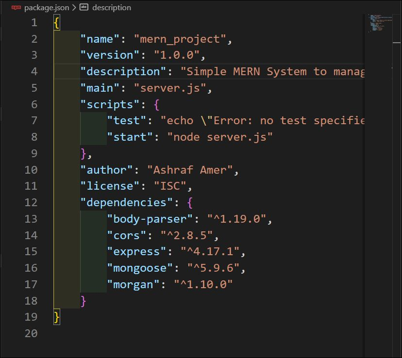

### Build a nodejs Sever MVC pattern:

1.  Controllers: 
    Controller functions recieve requists from client, get the requested data from the models DB, prepare data and send/ it direct to the client side.
     
    inside this controller we will create:

        - CourseController.js
        - DepartmentController.js
        - InstructorController.js
        - StudentsController.js

    inside each Controller we gonna to require the `Express` application object, uses it to get a `Router` object and then adds a couple of routes to it using HTTP verbs: `get()` , `post()`, `delete()` and so on..  
    To connect with MongoDB (`Models`), we require a specific model which we need to create an instance from its schema. 

    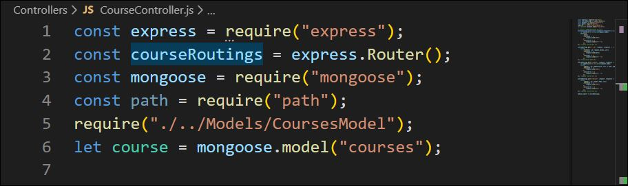

2.  Models: 
    inside this Models we will create:

        - CoursesModel.js
        - DepartmentsModel.js
        - InstructorsModel.js
        - StudentsModel.js

    Before you jump in and start coding the models, It's important to know that `Mongoose` is a MongoDB object modeling tool designed to work in an asynchronous environment. acts as a front end to MongoDB, an open source NoSQL database that uses a document-oriented data model. A "`collection`" of "`documents`" in a MongoDB database is analogous to a "`table`" of "`rows`" in a relational database.
      
    `Model`s are defined using the Schema interface. The Schema allows you to define the fields stored in each document along with their validation requirements and default values.
      

    > Each `model` maps to a `collection` of documents in the MongoDB database. The documents will contain the fields/schema types defined in the model Schema.

    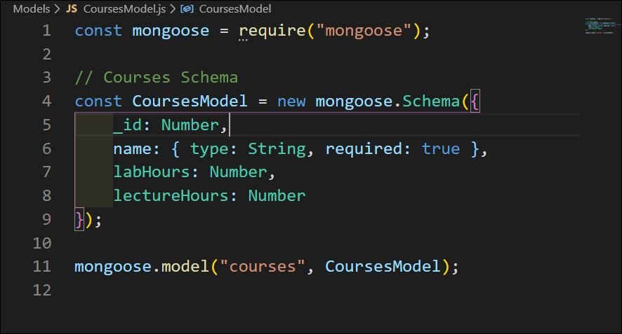

3.  Views : 
    In this dir we create our html templates which used by the controllers to render the data. We will cover this topic in details next few lines.
     
    Just Continue...

### Configure server.js [Root File]:

When running `npm init` command, we selected server.js as our entry point(root file). It's index.js by default, just names.!
 
So the app directs to `server.js` first and so we need to create and configure it.
 

-   1st require all packages installed
    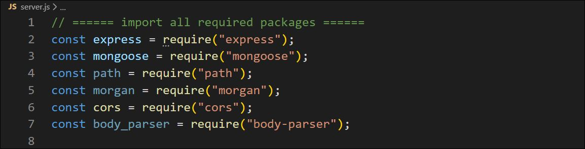
-   2nd require all required Controllers
    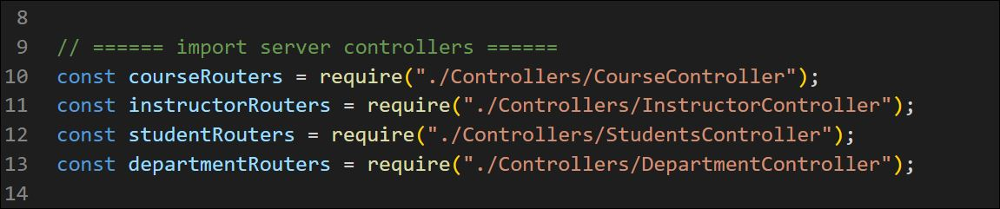
-   3rd listen to port 8085 (able to change)
    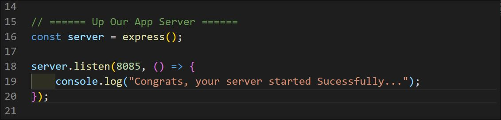
-   4th connect to MongoDB [ First Run `mongod` command ]
    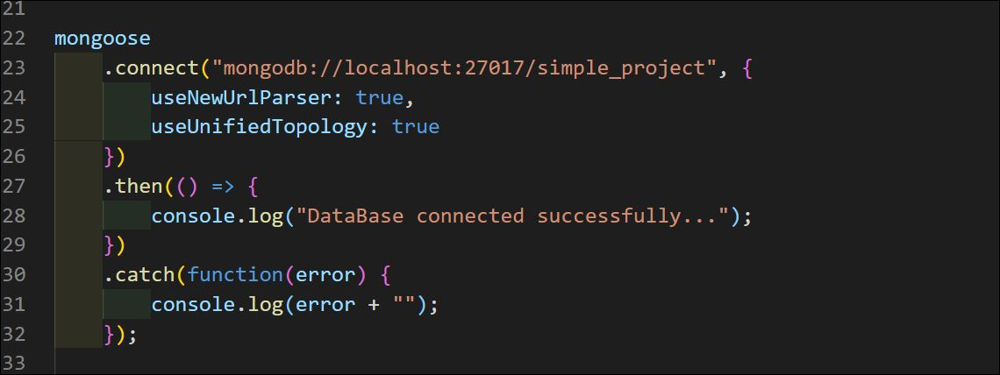
-   5th Config routers' middlewares
    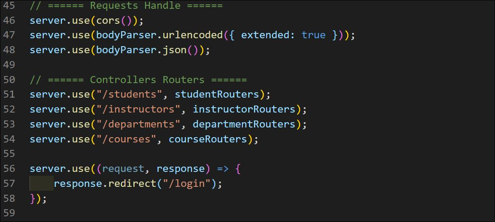

## Second: Creating a Client Frontend [React]:

here, we will use [Express view engine](https://www.npmjs.com/package/express-react-views) which renders React components on server. It renders static markup and does not support mounting those views on the client.

This is intended to be used as a replacement for existing server-side view solutions, like jade, ejs, or handlebars.

`npm i express-react-views react react-dom`

Then go to server.js to configure static paths and engine views

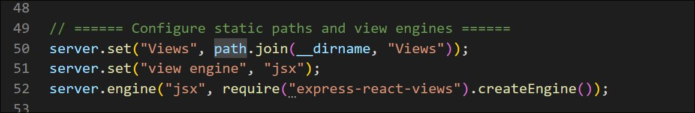

all after that work as ejs, but all data you will send from backend to react-views is located in `props`.

#### Example: send data from server/controller to react-views .jsx

1.  This get function select all courses from mongo database and render data to react-views for representing it to user
     
    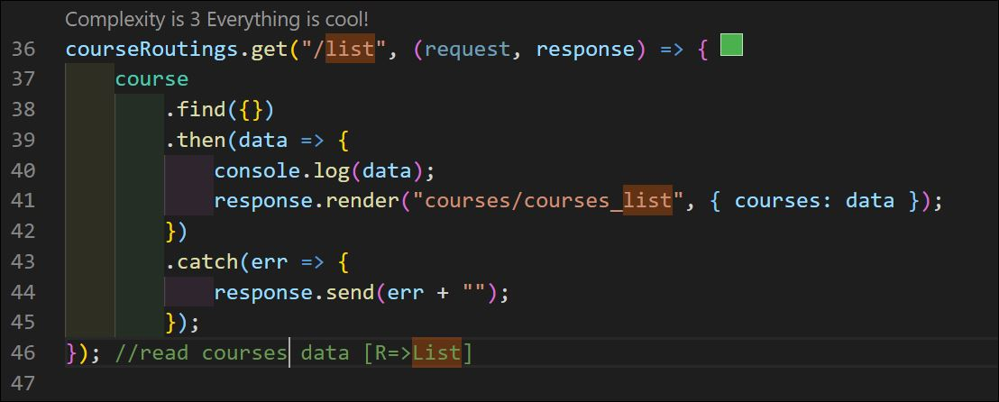
     
2.  receive data which sent into `courses` vaiable [ it is a List of Objects ], `courses` variable added by default to props in react-view.
     
    first we will require react inside views `const React = require("react");`, Then create our function component and exports it. like that:
     
    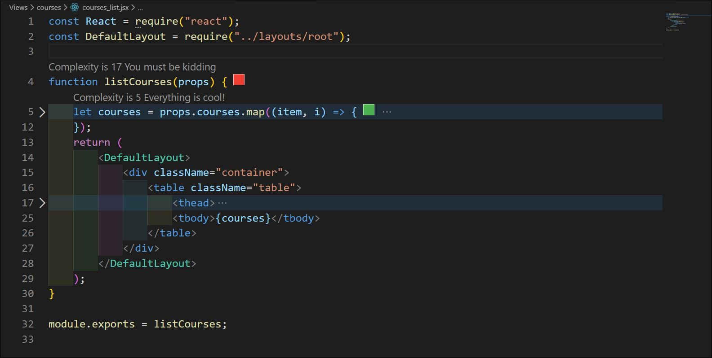
     
    Note that, `layouts/root` I created it to share header and footer between all pages.!

## More Topics: Encrypt and Decrypt passwords

let's do that using `crypto` package.
 
`npm i crypto`
 
Then go to StudentsController and require it
 
`const crypto = require("crypto");`
 
after that you need to create two functions: one for encrypt password and another to decrypt it.

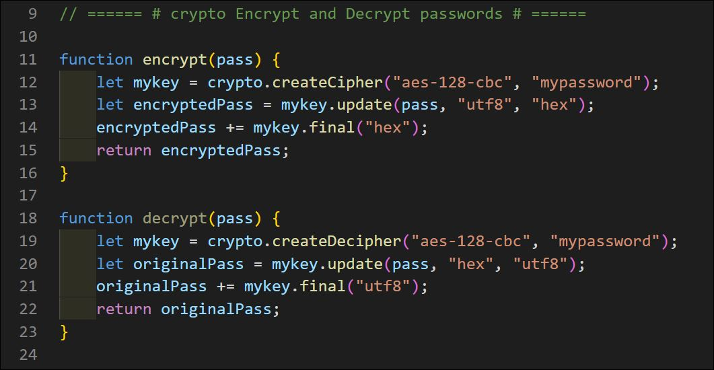

### Now, How to use this functions?!

before insert a new student/user you need to update password feild
 
`let newStudent = new student(request.body);`
 
`newStudent.password = encrypt(newStudent.password);`
 
Then insert it to your DataBase. it will be saved as string like that: `7359fa105ab38db08e3a70ac1953571b` .!

## More Topics: Set Session roles to Login and Logout

first we need to install [`express-session`](https://www.npmjs.com/package/express-session) package, using this command line:
 
`npm i express-session`
 
downloaded?! Then require it inside your server.js code `const session = require("express-session");`
 
before any routing, we need first to configure session settings inside server script:
 
`server.use(session({ secret: "abc123" }));`
 
[express-session](https://www.npmjs.com/package/express-session) documentation explain in details how to use it and more options are listed.

### Now, You are ready to set login and logout rules

Authentication will be done in 3 steps:
 

1.  Create an AuthController to set roles on session object as new property and modify it as you want. do that inside login function
    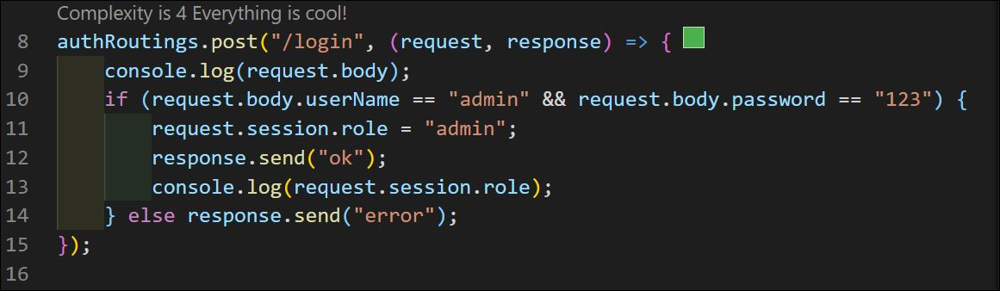

2.  use role property to build an auth middleware, if user has a role property in his session that's mean he logined to our system, so he can complite and access to our system functionality. but if he don't has any roles, our middleware will redirect him to login page.
    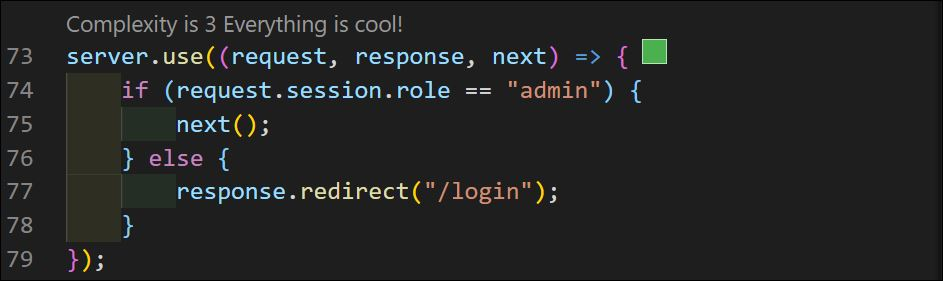

3.  finally, you can control user accessibility depending on session role property. but how user can logout? just destroy session.
     
    `request.session.destroy`
    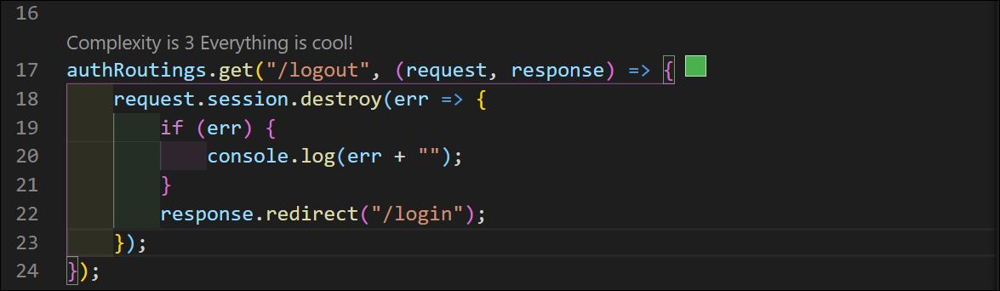
    
    
    
    

## Author

 Ashraf Amer

## License

Copyright(c) 2020 ITI OpenSource Track

